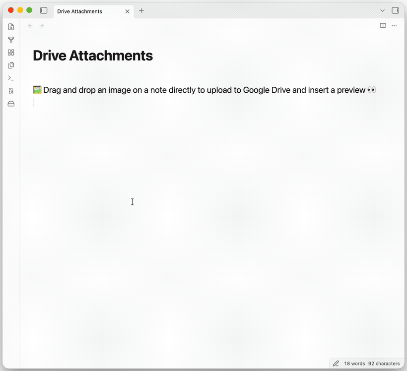
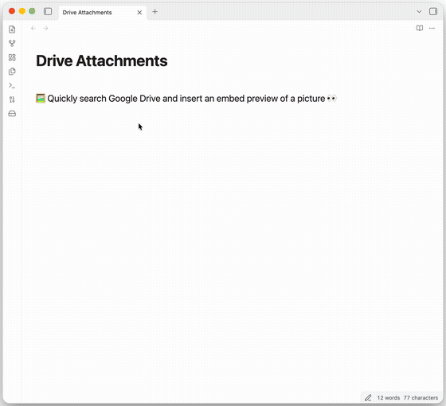
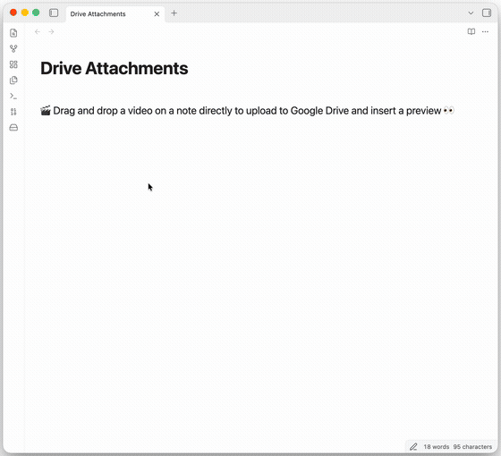
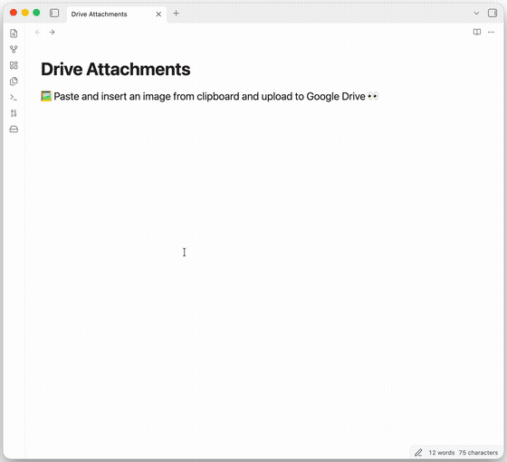
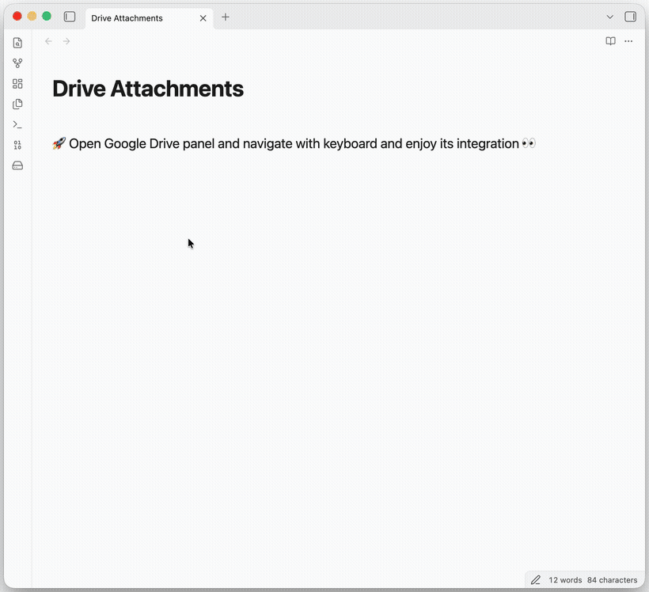
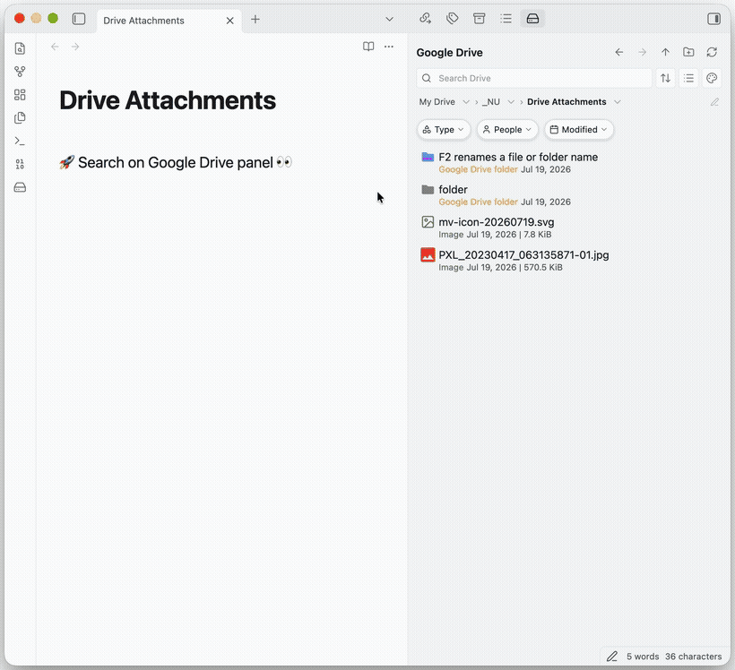
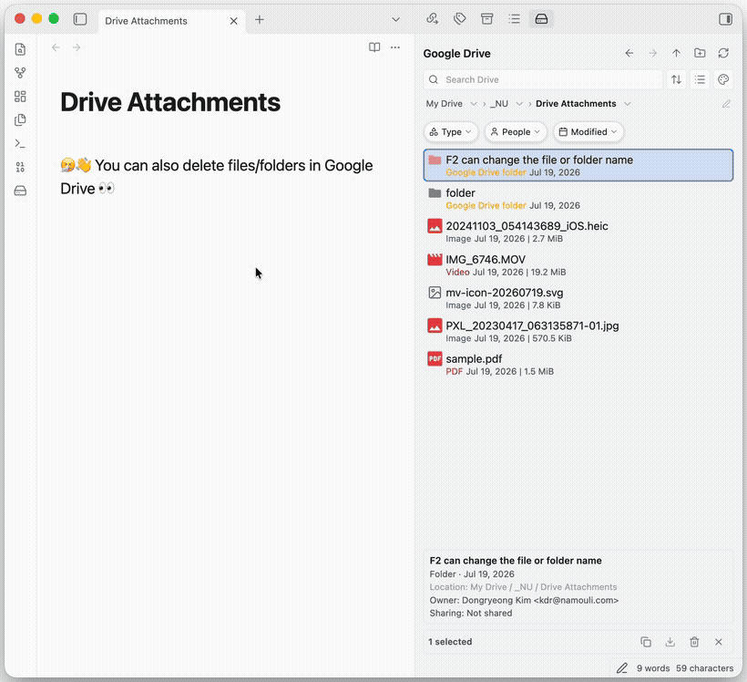
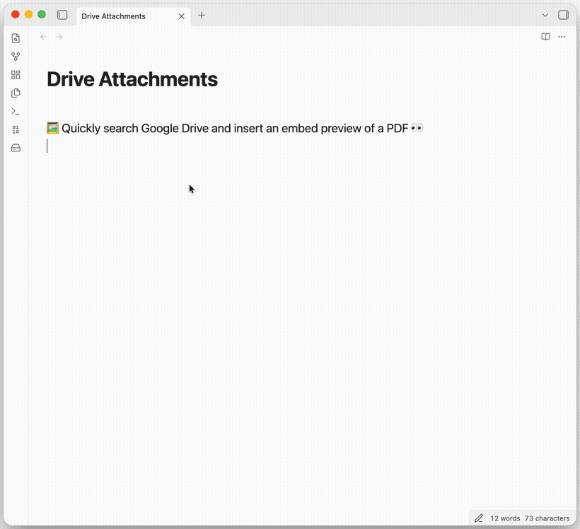
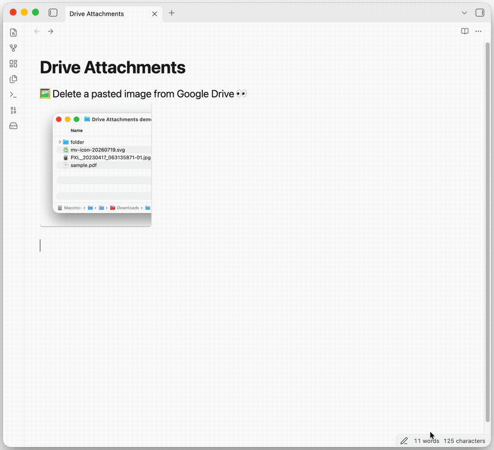
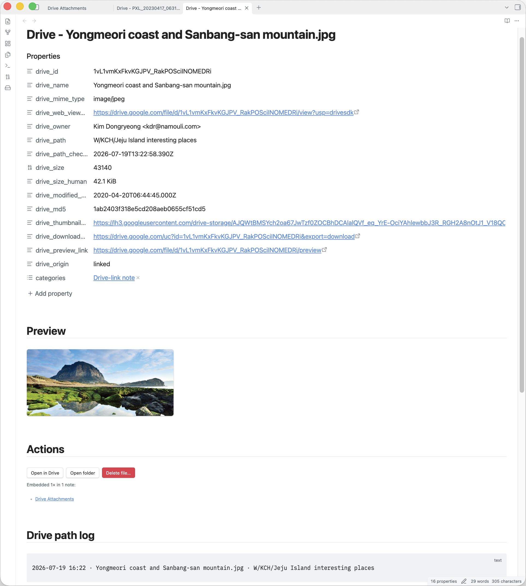

# Drive Attachments

### Store your Obsidian attachments in Google Drive — keep your vault small and fast to sync.

Drop a file into a note and it uploads to **your own Google Drive**, leaving a clean, clickable link in its place — images, videos, and PDFs still preview right there in the note. Your vault stays light and quick to sync, and every file is one click away.

<b><a href="obsidian://show-plugin?id=drive-attachments">Install in Obsidian →</a></b> &nbsp;·&nbsp; or search <b>“Drive Attachments”</b> in Community plugins

---

## Your vault is for notes — not for storing big files

Images, PDFs, videos, and design files quietly pile up until your vault is huge and slow to sync, and your backups balloon. Yet most of them you rarely open.

**Drive Attachments keeps those files in your Google Drive and keeps just a link in your note.** Your vault gets light and fast again — and nothing is lost. Every file is still there, one click away — and because each link points to the file’s permanent Drive ID (not its name or folder), it keeps working even after you rename or move the file in Drive.

---

## See it in action

Three ways to bring a Drive file into a note — **search** it, **drag** it in, or **paste** it.

| 🔍 Search &amp; insert | 🎬 Drag &amp; drop | 📋 Paste |
| :---: | :---: | :---: |
|  |  |  |
| Find any file and drop in a link | Drop a file (even a video) — it uploads and previews | Paste a screenshot and send it to Drive |

---

## Your whole Drive, right in the sidebar

Not just uploads — a **full Google Drive file manager built into Obsidian.** Browse My Drive and shared drives, open folders, and see your files without ever leaving your notes.

**Search it like drive.google.com — inside Obsidian.** Narrow by folder, file type, owner, or date, and jump straight to where a file lives.

**Organize and clean up, right there.** Rename, move, color-code, star, download — and delete files or folders you no longer need.

---

## More that makes it feel effortless

**🖼️ Your Drive files, right inside your notes.** Images, videos, and PDFs appear in the note itself — not just a link — while staying private in your Drive.

**♻️ No accidental duplicates.** Drop the same file twice and it simply reuses the one already in your Drive.

**🗑️ Delete right from the note.** Done with a file? Remove it — from your note and your Drive — without leaving Obsidian.

**🗒️ Turn a file into a real note.** Optionally give each file its own note — add your own tags, links, and notes so reference material becomes part of your vault, not a forgotten download.

**🧹 Already have a heavy vault?** One command moves your existing attachments to Drive and rewrites every link for you — and **nothing changes until you approve it**. You preview every change first, and local copies are only ever moved to your trash (recoverable), so your vault shrinks with nothing lost.

---

## Your files stay yours

This plugin connects your Obsidian **straight to your own Google Drive** — there’s nothing in between.

- **Only you can see your files.** Uploads stay private in your Drive, exactly like any other file there. Nothing is ever made public or shared.
- **No one else is involved.** No account to create, no company server in the middle, no ads, and nothing about you is tracked.
- **Your sign-in stays on your computer.**

---

## Get started

1. **Install** — in Obsidian: **Settings → Community plugins → Browse**, search **Drive Attachments**, then Install and Enable.
2. **Connect your Google account** — a one-time setup so everything runs through *your* Google. Plan about **10–15 minutes**: you’ll create a free personal Google app by following the step-by-step guide below (it names the exact buttons to click). Once it’s done, you never touch it again.

> **For Obsidian on desktop.** (The secure sign-in it uses isn’t available on phones yet.)

Want beta builds early? You can also install via <a href="https://github.com/TfTHacker/obsidian42-brat">BRAT</a>.

---

<b>⚙️ One-time setup — connect your Google Drive</b> (click to expand)

 

You’ll create a free personal Google app — think of it as a private key that connects Obsidian straight to your Drive, so your files never pass through anyone else’s server. It’s a one-time setup, 6 short steps:

1. **Create a Google Cloud project** — in the [Google Cloud Console](https://console.cloud.google.com/).
2. **Enable the Google Drive API** — search for it in your project and turn it on.
3. **Set up the OAuth consent screen** — under **Google Auth Platform → Audience**. Pick **External** if you use an @gmail.com account, or **Internal** if you have a Google Workspace organization.
4. **Publish the app** *(External only)* — still under **Audience**, click **Publish app** (one click, so Google doesn’t sign you out every 7 days). *(Internal? Skip this.)*
5. **Create an OAuth client & download JSON** — make an **OAuth client ID** of type **Desktop app**, then click **Download JSON**. That one file is your key.
6. **Import the JSON in the plugin** — in the plugin’s settings, click **Select .json file** (or **Paste JSON** if someone sent you the contents). The Google sign-in opens by itself — approve it, and you’re connected.

<b>Use Google’s own file-picker popup (optional)</b>

 

Everything works without it — search and the sidebar already cover browsing. If you also want Google’s Picker window, turn on the **Google Picker API** in your project, create an **API key** (**Credentials → Create credentials → API key**), and paste it into the plugin’s Picker setting.

<b>Your data is safe</b>

 

Your sign-in stays on your own computer — saved only inside your vault at `<vault>/.obsidian/plugins/drive-attachments/data.json`, and never sent anywhere else. It’s yours alone; the only thing to remember is not to share that one file (or sync it anywhere public).

<b>Common questions &amp; fixes</b>

 

**“Google hasn’t verified this app.”** That’s expected — you made this app for yourself, so Google treats you as its developer. Click **Advanced → Go to &lt;your app&gt;** to continue.

**Search finds nothing / connection issues.** Make sure the **Google Drive API** is turned on for your project, then reconnect from the plugin settings.

**Choosing where uploads go.** In settings → Default upload folder, click the folder button to browse your Drive, or paste the folder's link straight from drive.google.com. Leave it empty to upload to your Drive root.

**Deleting files the plugin didn’t upload.** By default the plugin can only delete files it created. To let it delete anything in your Drive, grant full Drive access in the plugin settings (and on the Google consent screen) — enable this only if you’re comfortable with that.

Found a bug or have an idea? [Open an issue on GitHub](https://github.com/kim-dongryeong/obsidian-drive-attachments/issues).

## Credits

Inspired by and building on the ideas of [Google Drive Folder Link](https://github.com/andrewmarconi/GoogleDriveFolderLink) by Andrew Marconi.

## License

[AGPL-3.0](LICENSE) © Kim Dongryeong — free to use, change, and share; anything built from it stays open source, even when it’s offered as an online service.
